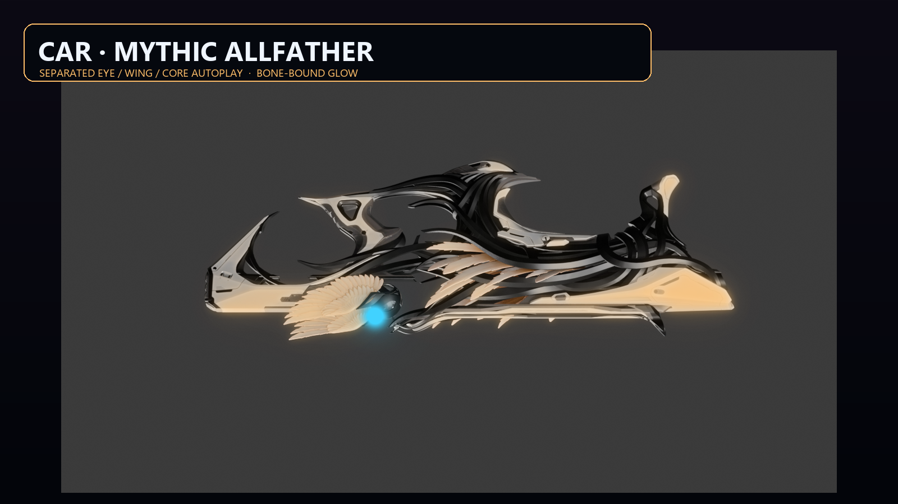
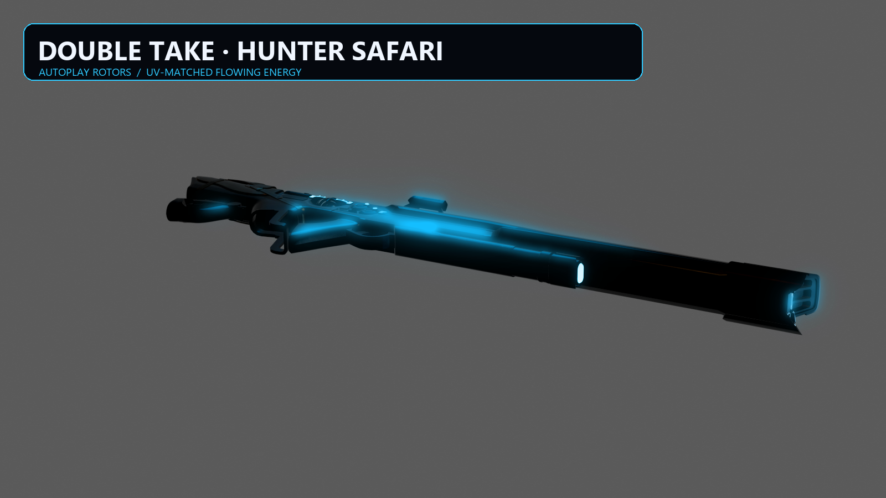

# Titanfall 2 CAR 模组

这里保存目前整理完成的 Northstar / R2Vanilla CAR 替换模组安装包。

## Idle Auto Delta + 完整 PCF 清单修正版（2026-09-17）

此前 1.3.0 / 1.0.9 错把 Delta 建成独立 autoplay 序列，并使用了只含自定义 PCF 的精简粒子清单，现已废弃。修正版严格把效果层烘焙进原有 `idle_anim_autoplay` 与 `idle_ads_anim_autoplay`：CAR 写入 107 个眼睛、翅膀和羽毛效果骨骼，并把开火层写入原攻击动画；双重击写入 4 个时间装置骨骼。模型中不再包含新建的 reactive/rotor autoplay 序列。

两包都从原版前端 VPK 提取完整 `particles_manifest.txt`，保留全部原版粒子条目后仅追加自己的 PCF，避免覆盖地图与环境粒子注册。QC 事件名已与反向解码后的 PCF 特效名逐项核对。双重击继续保留 5 个原版内嵌 RUI 和原版瞄具。

- `CAR.Mythic.Allfather-1.3.1-idleauto-pcf.zip`
- `Codex.DoubleTake.HunterSafari-1.0.10-idleauto-pcf.zip`
- [制作说明与静态核对](docs/2026-09-17-idleauto-pcf/BUILD-NOTES.md)
- [v2026.09.17-idleauto-pcf 下载](https://github.com/ht1580/titanfall2-car-mods/releases/tag/v2026.09.17-idleauto-pcf)

当前 Apex 安装不含旧版 Huntersafari reactive ASeq，因此双重击转环是基于现有 Apex 时间装置骨骼制作的兼容 Delta，并非原版 Apex 动画。两包已完成离线编译、MDL53 转换、PCF 反向解码、RUI、ZIP 与哈希检查；未启动游戏验证。

## TitanfallModWorkbench 1.5.0 全自动替换

工作台现在可扫描 Apex 武器皮肤和 Titanfall 2 武器模型，在“全自动替换”页选择来源与目标后，自动完成 VPK 提取、完整目标 QC/动画恢复、Apex 网格与目标骨架映射、VTF/VMT 生成、StudioMDL 编译、MDL v53 转换、原版 RUI 保留及 Northstar ZIP 打包。

默认同时生成第一与第三人称模型，固定 `LoadPriority: 0`，不覆盖 weapon 脚本，也不写全局 RPak 图层。独立 EXE 已通过一次实际的端到端离线生成；游戏内位置、遮挡和动作观感仍由使用者验收。

- [1.5.0 源码](tools/TitanfallModWorkbench)
- [1.5.0 发布说明](docs/2026-09-17-auto-replace/RELEASE-NOTES.md)
- [v2026.09.17-auto-replace 下载](https://github.com/ht1580/titanfall2-car-mods/releases/tag/v2026.09.17-auto-replace)

## 最新核对状态（2026-09-17）

已发布两套带动画/发光候选包和 TitanfallModWorkbench 1.4.0。工作台新增 ILM/UV 发光覆盖层、动态 VMT、幂等 `autoplay` 序列、按骨骼名称固化内嵌 RUI、Northstar 脚本/PCF/图层污染审计，以及配方驱动的预览输出。

- `CAR.Mythic.Allfather-1.2.0-animatedfx.zip`：恢复眼睛、翅膀和枪身的独立循环序列，使用随骨骼移动的发光层。
- `Codex.DoubleTake.HunterSafari-1.0.8-animatedfx.zip`：保留原版双重击瞄具兼容路径，加入三个转环骨骼循环和第一/第三人称发光覆盖层。
- [脚本、动画、特效与 RUI 规范](docs/2026-09-17/NORTHSTAR-SCRIPT-AND-FX-GUIDE.md)
- [本次交付记录](docs/2026-09-17/DELIVERY-NOTES-2026-09-17.md)
- [完整静态审计](docs/2026-09-17/FINAL-AUDIT.json)

两套新包均完成结构、MDL 序列、RUI 数量、材质引用和脚本风险的静态核对；没有代替用户启动游戏，因此仍是候选包。

### 带特效预览





### 1.4.0 工具源码

可维护源码位于 [`tools/TitanfallModWorkbench`](tools/TitanfallModWorkbench)。复制 `animated-fx-recipe-template.json` 后，可在 GUI 或命令行直接运行整套动画、发光、RUI 与审计流程。

所有本次二进制、完整源码包和原尺寸预览集中在 [v2026.09.17-animated-fx Release](https://github.com/ht1580/titanfall2-car-mods/releases/tag/v2026.09.17-animated-fx)。

## 2026-09-15 跨设备交接 / 1.0.11 候选包

已定位外域毁灭者旧贴图的重复 sRGB 编码：源图平均 RGB 为 51/41/40，旧 DDS 变为 108/100/100。1.0.11 使用明确的输入/输出颜色空间重新编码，像素误差已降至约 0.08/255。**游戏内暗处表现仍待用户确认；旧 1.0.9/1.0.10 的泛白反馈未解决，不能当作已验收。**

- [跨设备交接文档](docs/HANDOFF-2026-09-15.md)：当前状态、证据、待办、离线重建方法。
- [完整离线资源与 1.0.11 候选安装包](https://github.com/ht1580/titanfall2-car-mods/releases/tag/v2026.09.15-handoff)。
- 完整资源 ZIP 内置 Python/Pillow、texconv、RePak、RSX、原始导出、模型、历史源包和本次脚本。解压后运行 `REBUILD.cmd` 即可重建，不会自动安装或启动游戏。

## 此前发布版本

- `CAR.Mythic.Allfather-1.1.1.zip`：CAR 神话皮版本；恢复 Apex 原始装饰层级权重，第一人称将核心、眼睛和左右翅膀拆为三个独立循环动画，枪身保持固定；第三人称保留核心循环，避免重新引入翅膀错位。枪口弹道与枪口特效起点沿枪管向后移动 0.65 模型单位。
- `CAR.OutlandsAnnihilator-1.0.10.zip`：CAR 外域毁灭者版本，保留静态计数器和 1.0.9 不透明材质修复；枪口弹道与枪口特效起点沿枪管向后移动 0.65 模型单位。
- `CAR.RichMahogany-1.1.10.zip`：CAR 桃心花木版本，包含机瞄绑定修正。

三个 CAR 替换模组互斥，同一时间只启用一个。

## 安装

1. 关闭游戏和 Northstar。
2. 解压需要使用的 ZIP。
3. 将解压得到的模组文件夹放入 `Titanfall2/R2Vanilla/mods/`。
4. 移走或禁用另外两个 CAR 替换模组以及旧版本，避免模型、材质或脚本相互覆盖。
5. 启动 Northstar。

这些包的 `LoadPriority` 均按当前兼容方案设置为 `0`。本轮只做了资源结构、模型引用、材质路径和打包内容核对，尚未代替用户进行游戏内验证。

## 文件校验（SHA-256）

```text
B284DA1BE03E9C14934594F9C5F073D43D5467DCDD143D0C29E780EC4F7454E6  CAR.Mythic.Allfather-1.1.1.zip
07AD35CF1BB6726247336276A412CBE7120C6A0C136E1849AFD62BEEECAE0776  CAR.OutlandsAnnihilator-1.0.10.zip
B82660255C62D75618EC15D0E6181DA8CD42F57812D47FFDD20E742BD8D8280D  CAR.RichMahogany-1.1.10.zip
```

详细核对记录位于 `docs/`。

Mythic Allfather 1.1.1 的[贴图与 PCF 核对](docs/Mythic-Allfather-1.1.1-texture-pcf-audit-2026-09-15.md)确认了底色重复 sRGB 编码、换色发光叠层映射遗漏，并发现客户端粒子 API 兼容风险；现有安装包尚未修正，也未通过游戏内验证。

## 原始制作资料

完整制作资料作为 Release 附件提供：

- [`CAR-Source-and-Final-Resources-2026-09-14.zip`](https://github.com/ht1580/titanfall2-car-mods/releases/download/v2026.09.14/CAR-Source-and-Final-Resources-2026-09-14.zip)
- 大小：521,575,582 字节
- SHA-256：`04E73F074C59B96F28CFCBD1B1DB681DCDA5BAED82521ECE3687B320B6C1F035`

主资料包包含制作工具、自动化脚本、SMD/QC、Blender 预览、模型和材质制作资源，以及三个展开后的模组和安装包。

RePak 1.4 更新后的脚本、map、材质、RPAK、1.0.8 成品和 Titanfall Mod Workbench 1.3.0 位于 Release 附件 [`CAR-RePak-1.4-Source-Update-2026-09-14.zip`](https://github.com/ht1580/titanfall2-car-mods/releases/download/v2026.09.14/CAR-RePak-1.4-Source-Update-2026-09-14.zip)，SHA-256 为 `1F5E76A35D4A4514DB43F1EF7F6122BEA39003F3443DD81F92089F1F1C8CA16A`。

外域毁灭者 1.0.9 的暗处泛白修复脚本、材质 JSON/UBER 和核对记录位于 [`CAR-Outlands-Material-Fix-Source-1.0.9.zip`](https://github.com/ht1580/titanfall2-car-mods/releases/download/v2026.09.14/CAR-Outlands-Material-Fix-Source-1.0.9.zip)，SHA-256 为 `11A101890A5AADC75C7629DC8C0F27A5B41374DAE8BD3AE851AF18043D7F21C1`。

两套 1.0.10 模组的枪口附件源 QC 与核对记录位于 [`CAR-Muzzle-Attachment-Source-1.0.10.zip`](https://github.com/ht1580/titanfall2-car-mods/releases/download/v2026.09.14/CAR-Muzzle-Attachment-Source-1.0.10.zip)，SHA-256 为 `B9B336E4CD4C202828B9443FB02F3BB586F559F3F7618EBD02F1907ADB91B7B5`。

神话皮 1.1.1 的独立动画脚本、完整 Apex 权重 SMD/QC、绑定核对和 Blender 动画预览位于 [`CAR-Mythic-Independent-Animation-Source-1.1.1.zip`](https://github.com/ht1580/titanfall2-car-mods/releases/download/v2026.09.14/CAR-Mythic-Independent-Animation-Source-1.1.1.zip)，SHA-256 为 `7BFFB818BD0B49045322335DC6CE553723D231E07CD107F3C9C71AA94246419C`。

神话皮 1.0.9 的 PCF 文本源、已编译 PCF、Northstar 粒子清单、客户端挂载脚本和带 VFX 挂点的 QC 位于 [`CAR-Mythic-PCF-Source-Update-1.0.9.zip`](https://github.com/ht1580/titanfall2-car-mods/releases/download/v2026.09.14/CAR-Mythic-PCF-Source-Update-1.0.9.zip)，SHA-256 为 `92689514E04F87EC051FA9B38E6D85EC29A8D392AB60518E41AB78CB3620663A`。

可直接下载 [`TitanfallModWorkbench-1.3.0.exe`](https://github.com/ht1580/titanfall2-car-mods/releases/download/v2026.09.14/TitanfallModWorkbench-1.3.0.exe)。Workbench 1.3.0 的 GUI 默认使用 RePak 1.4，仍可选择 1.2 兼容旧 map。
