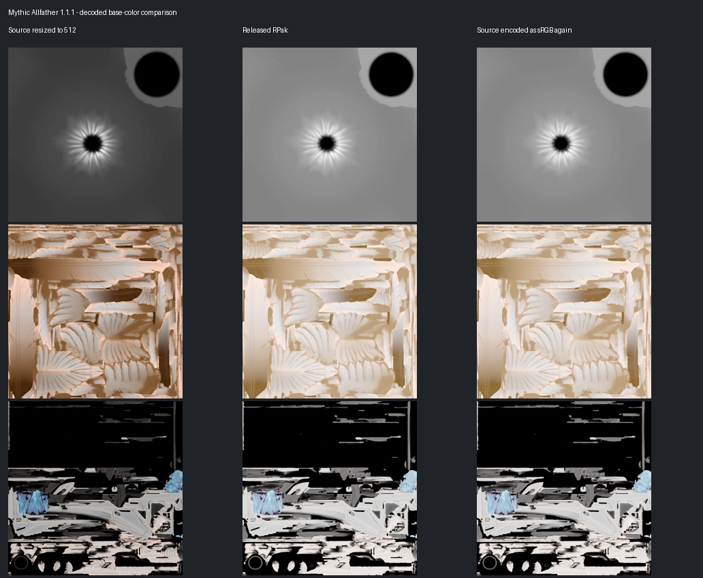

# Mythic Allfather 1.1.1 贴图与 PCF 核对

核对对象为已发布的 `CAR.Mythic.Allfather-1.1.1.zip`。结论：底色存在重复 sRGB 编码，换色发光叠层未接入模型皮肤映射；PCF 二进制完整，但客户端挂载脚本混用服务端粒子 API，不能判为运行通过。本次仅核对，没有重建或替换安装包，没有启动游戏。

## 已确认：12 张底色被重复 sRGB 编码

直接读取成品 `car_mythic_complete.rpak` 的资源表和驻留 mip 数据，按纹理 GUID 与原始制作 map 对应，重建 DDS 后解码比较。不是仅检查旧工程里的 DDS 文件头。

全部 12 张 `*_col` 都是 BC7_UNORM_SRGB，但存储像素比源 PNG 明显变亮。把源图数值再作一次 linear→sRGB 变换，与成品的逐通道平均绝对误差仅为 0.19–1.12/255，支持重复编码这一诊断。

| 默认材质 | 编码前 RGB 均值 | 成品 RGB 均值 | 成品与源图的逐通道 MAE |
| --- | --- | --- | --- |
| 眼部 | 66.54 / 66.30 / 66.54 | 134.33 / 134.10 / 134.41 | 67.79 / 67.80 / 67.87 |
| 羽翼 | 170.86 / 143.18 / 121.99 | 212.11 / 194.63 / 177.89 | 41.25 / 51.45 / 55.90 |
| 枪身 | 59.73 / 58.58 / 58.11 | 84.70 / 83.91 / 83.60 | 24.97 / 25.33 / 25.49 |

比较基准为制作工程中间 PNG 等比缩小到成品 512² 后的数值。另与归档的 Apex 原始导出交叉比较：12 张底色源均有 `sRGB=0`、`gamma=0.45455` 标记；中间图与原始图按相同输出尺寸比较的逐通道 MAE 为 0–0.24/255，说明异常发生在后续编码，而不是原始底色本来就这么亮。

源脚本 `TitanfallModWorkbench/core.py:631` 调用 texconv 时只指定输出格式，没有明确输入也为 sRGB。应重做这 12 张底色的输入/输出颜色空间，并解码复核像素；不能仅修改 DDS 格式标记或继续压暗材质补偿。其余通道应按实际语义单独保留，不能统一作 sRGB 转换。

## 已确认：换色发光叠层未接入皮肤映射

第一、第三人称最新 QC 的九行 `$texturegroup` 均引用 `eye_default`、`main_default` 两个发光 VMT；rt01、rt02、rt03 行只更换 RPak 主材质，发光叠层仍为 default。成品 MDL 的材质表与皮肤表也作了直接核对，见同名 JSON 的模型材料记录。

包内六个 rt01/rt02/rt03 发光 VMT 存在，所引用 VTF 也存在，但这些换色 VMT 没进入模型材质表。因此不能说发光叠层随换色正确切换。眼部四份 VTF 完全相同；枪身 main_rt01、main_rt03 与 default 的 VTF 哈希不同，main_rt02 与 default 相同。该遗漏至少会使有实际差异的枪身叠层资源无法被选中。RPak 的换色材质和 ILM 引用本身存在，不能据此扩大为所有发光都失效。

## PCF：二进制通过，客户端调用存在高风险

成品 PCF 与 1.0.9 PCF 源包中的二进制逐字节一致。DMX binary 5 / pcf 2 可完整解析：265 个元素、19 个系统；与文本源逐属性比较，float32 规范化后零差异。所有系统都带 `codex_car_mythic_` 前缀，manifest、脚本入口、预缓存名称和模型挂点均能对应。

但 `cl_codex_car_mythic_fx.gnut:55–59` 在 CLIENT 脚本调用 `StartParticleEffectOnEntity_ReturnEntity`，用 `array<entity>` 保存结果，并在 `:32–33` 用单参数 `EffectStop(entity)` 清理。这与 Northstar 官方客户端用法不一致：官方 CLIENT 使用 `int` 粒子句柄、`EffectDoesExist` 和 `EffectStop(handle, false, true)`；entity 版本用于 SERVER。存在阻断脚本加载或执行的风险，应优先核对并改正。没有实际客户端编译日志，不能声称已经捕获某条游戏报错。

依据：[Northstar 服务端粒子接口](https://docs.northstar.tf/Modding/reference/respawn/native_server/particles/)；[官方 sh_stim.gnut 的 SERVER/CLIENT 分支](https://github.com/R2Northstar/NorthstarMods/blob/426ce10ac4bcd25df9e52442dc77598ec035bce6/Northstar.Custom/mod/scripts/vscripts/weapons/sh_stim.gnut#L66)。

其他静态发现与验证边界：

- 只在初始化和切换武器后等待 0.10 秒检查一次模型；模型或挂点尚未就绪时退出，没有重试。死亡、视角变化、同一武器模型重建没有显式覆盖。实际是否漏建或残留仍取决于引擎行为。
- 脚本仅直接调用 glow、dlight 两个系统，共两处光晕、一处动态光；19 个系统中的其他电弧、火花、烟雾没有被调用。不能当作完整 Apex 神话粒子还原。
- glow 为固定金色，dlight 在紫金之间随机；脚本不读取 skin/bodygroup，也不更新颜色控制点。只对第一人称 viewModel 创建，第三人称模型有挂点但没有对应创建逻辑。
- 实际直接调用的两个子系统没有显式 `view model effect`；带该标记的是未调用的 FP 父系统。开镜、FOV 与深度表现需游戏验证，不能仅凭缺省字段断言画面错误。
- PCF 依赖基础游戏材质 `particle/glows/energy_cloud_add_03ob.vmt` 和 `particle/glows/glow_soft_linear_noz.vmt`。它们与包内枪身 VMT 叠层是两条独立路径。本机未提供基础游戏资源，未核实这两项外部依赖。

## 已通过的资源检查

- ZIP CRC 正常，安装包 SHA-256 与 README 相同。
- RPak 28,023,152 字节，128 个资源：80 张贴图、48 个材质。所有材质纹理 GUID 指向包内已定义贴图，驻留 mip 数据完整，没有 starpak 依赖。
- 80 张贴图均为 512²、10 级 mip：12 张 col 为 BC7 sRGB，12 张法线为 BC5，56 张其余纹理为 BC7 线性。spc 实际为线性 BC7，不应直接套用其他模组的格式说明；gls 使用 BC7 本身不是文件错误。
- 法线仅比较 BC5 实际存储的 R/G；其余非 col 通道与工程中间图的最大逐通道 MAE 均低于 3/255，没有发现同类重复 sRGB 变亮。15 张辅助通道在原制作流程中使用默认图，不能当作遗失的成品资源。
- 8 个发光 VMT 的纹理引用均有文件，9 个 VTF 全部可读取完整 mip 链：8 张 512² DXT5 发光图、1 张 16² 白图。VTF 与原始 ILM 的数值不同，不能在缺少发光图制作参数时当作无损复刻；材质还含 4 倍亮度和 Sine 呼吸代理，亮度不能仅凭像素均值验收。
- 编译 MDL 的 VFX_eye / VFX_base / VFX_Bifrost 挂点与 1.1.1 QC 一致，骨骼索引有效。VFX_eye 绑定 def_core_orb，VFX_Bifrost 绑定 def_c_base；动画后的最终屏幕位置未实测。

## 证据与复核

完整机器记录：[同名 JSON](Mythic-Allfather-1.1.1-texture-pcf-audit-2026-09-15.json)。本机展开资料、解码 DDS、PNG 和复核脚本位于 `D:/Project_Yunler/car-mythic-audit/`，入口为 `audit_textures.py`、`audit_vtf.py`、`inspect_pcf.py`。纹理脚本基于 [RePak 1.2.0 结构定义](https://github.com/r-ex/RePak/blob/1.2.0/RePak/include/rpak.h)读取版本 7 RPak，逐项验证 GUID、资源界限与 mip 长度。

安装包 SHA-256：`b284da1be03e9c14934594f9c5f073d43d5467dcdd143d0c29e780ec4f7454e6`。

RPak SHA-256：`1a5a9a3512ba64d85c0e3f460fdfc528c7aee7286ce4cc7ae6f87f310dcd3983`。

PCF SHA-256：`8494e08caedf84e690fba51b7ec519e58f38167c1d50e7ad2fa50345b282b525`。

本记录确认的是文件、像素与引用关系，不代表游戏中的发光强度、动态光、遮挡、开镜投影或切枪生命周期通过验收。
